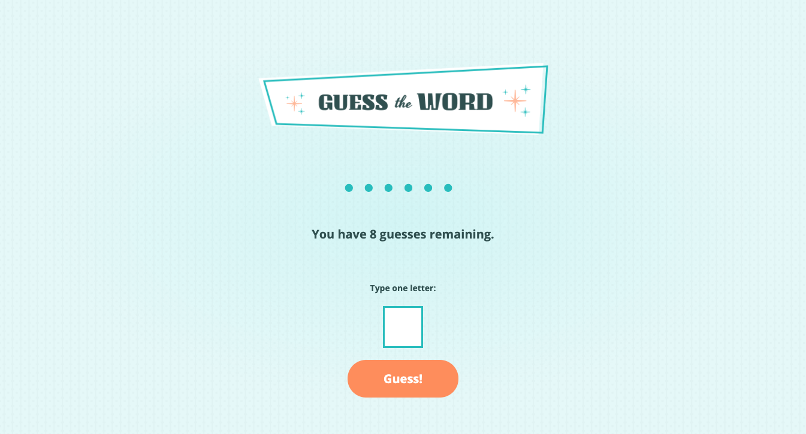
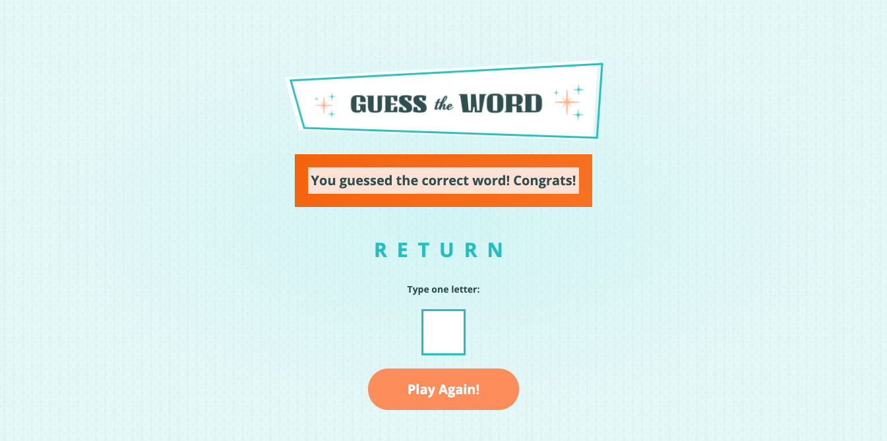

<h1 align="center">Guess The Word Game</h1>

https://crenauro.github.io/guess-the-word/

# Install

Open the above link in your browser.
 
 

# Usage

The game starts with a word on the screen hidden by placeholders ● . Players start by entering a letter. If they guess correctly, the letter appears in the word.
If they guess incorrectly, they learn how many guesses they have remaining. If the player guesses all letters correctly before they use up all of their guesses, they win.
